# Proyecto Reino del Trebol
## Introducción
WEB API desarrollado en C# .net core 6 y MySQL, sistema que automatiza el proceso de solicitud de estudiantes y asignación de Grimorios, requerimientos y objetivos definidos por el Rey Mago del Reino del Trébol.


## Requerimientos
De acuerdo a la información otorgada por el Rey Mago se realizó la siguiente lista de requerimientos: 
1. Registro de estudiantes.
2. Actualizar información de estudiantes ya registrados.
3. Aprobación/Rechazo de solicitudes de ingreso.
4. Asignación de Grimorios.
5. Rechazo automático de estudiantes, si su información no cumple con las reglas:
    - Nombre (solo letras, máximo 20 caracteres).
    - Apellido (solo letras, máximo 20 caracteres).
    - Identificación (números y letras, máximo 10 caracteres).
    - Edad (solo números, 2 dígitos).
    - Afinidad mágica (mencionadas anteriormente).
6. Consultar todas las solicitudes de ingreso..
7. Consultar todas las asignaciones de Grimorios.
8. Eliminar solicitudes de ingreso.
9. Creación de catálogos Magia, Grimorios y Tipo de Trébol.

## Herramientas
* Para el desarrollo, diseño y pruebas de este proyecto se utilizaron las siguientes herramientas:
* IDE Desarrollo: Visual Studio 2022
* Framework: .NET Core 6
* Lenguaje: C#
* BD: MySQL
* IDE BD: MySdQL Workbench 8.0
* Pruebas: Postman

## Base de Datos MySQL
Se diseñó una base de datos No Relacional en MySQL, el diagrama a continuación muestra las tablas y campos de cada una, se tienen lineas de union pero solo muestran el uso lógico que se otorga a nivel programación:
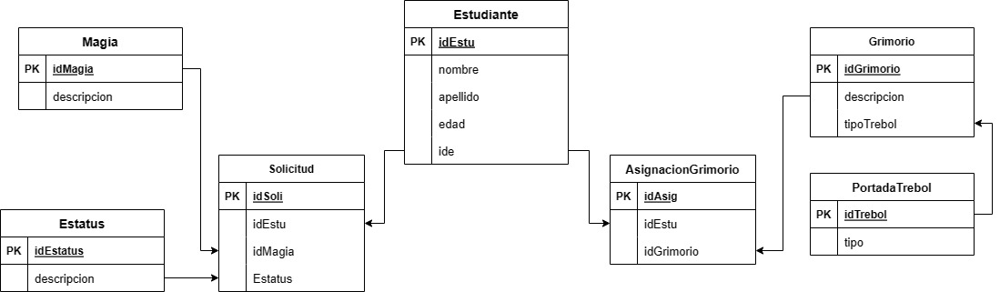


También se generaron dos SP (Store Procedure) para obtener información y cumplir con los requerimientos 6 y 7:
1. Consultar todas las solicitudes de ingreso. Donde se realizó la unión de las tablas:
    - Magia
    - Estatus
    - Solicitud
    - Estudiante
Para obtener un reporte con la siguiente información:
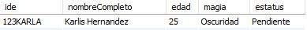

2. Consultar todas las asignaciones de Grimorios. Donde se realizó la unión de las tablas:
    - Grimorio
    - PortadaTrebol
    - AsignacionGrimorio
    - Estudiante
  Para obtener un reporte con la siguiente información:
  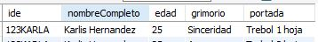


## Instalación
En cuanto a la instalación es necesario tener la BD en nuestro equipo, para ello utilizamos MySQL.

### Base de Datos
A continuación compartiremos los pasos para la instalación de MySQL:
1. Descargar el instalador desde su pagina Web 
[MySQL :: Download MySQL Community Server](https://dev.mysql.com/downloads/windows/installer/8.0.html)
2. Te recomendamos el instalador que descarga  todos los componentes durante la instalacion que es este:
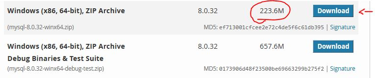

3. Cuando ya esté descargado, ejecuta el instalador.
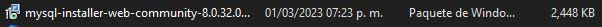

4. En la mayoría de las secciones es suficiente darle clic en Siguiente, pero es importante en la sección de usuarios y contraseñas colocar el usuario administrador o agregar un usario adicional como *ReyMago* y guardar la contraseña porque esta te servirá más adelante para la configuración del API.
5. La pestaña donde se configura el usuario y contraseña se ve así:
    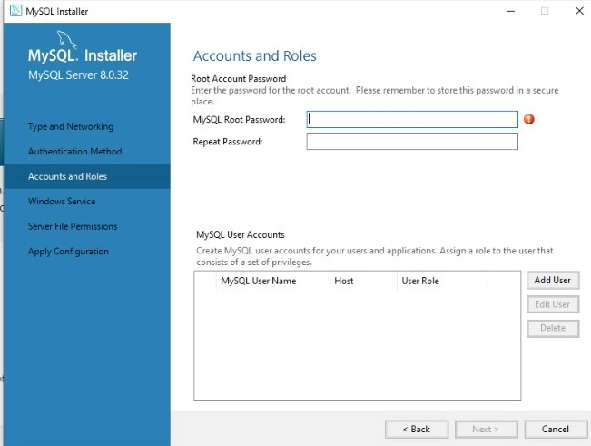
6. Una vez instalado ya se puede abrir MySQL Workbench para realizar la importación de la BD.
7. Es necesario abrir la conexion con el usuario ReyMago y la constraseña previante asignada.
8. Para realizar la importación es necesario descargar el archivo **"BD_ReinoTrebol.sql"** que se encuentra en la carpeta **“BaseDatos_MySQL”**. Este archivo contiene la estructura, datos y Store Procedure de la Base Datos que se usa en la API.
9. En Workbench iremos a la opción Server > Data Import
10. Se abrirá una ventana donde seleccionaremos la opción:
        - Import fromSelf_Contained file
11. En la misma venta del lado derecho dar clic en el botón con 3 puntos (...) y se selecciona el archivo reino_trebol.sql, que se encuentra en la carpeta que descargaste anteriormente Paso 7.
12. En la sección Default Schema to be… dar clic en el botón New… se abrirá una pequeña ventana donde es necesario colocar el nombre reinotrebol.
13. En la parte de abajo del lado derecho se encuentra un botón Start Import, dar clic para comenzar la importación.
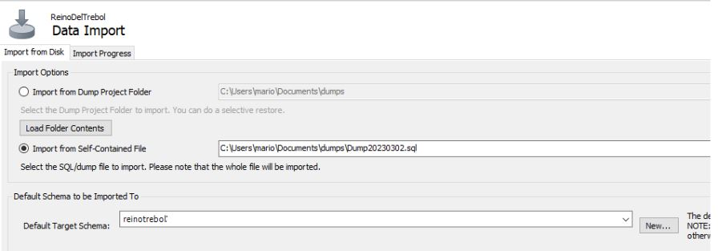
14. Al finalizar se mostrará el mensaje …has finished.
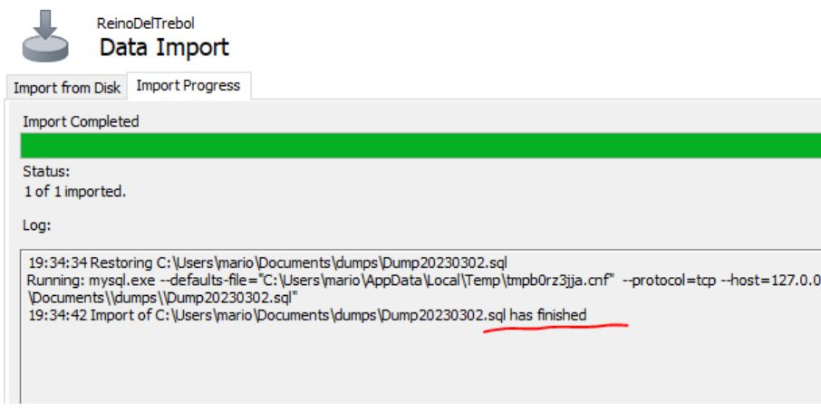
15. Del lado izquierdo en el panel de SCHEMAS  al dar clic en el icono de refresh se podrá visualizar nuestra BD importada.
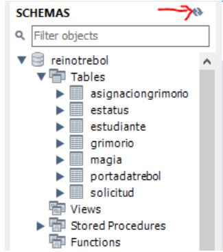
16. Listo ya tienes la BD en tu equipo, ahora podemos proceder a la ejecución de la API.

## Ejecución
Para la ejecución se puede realizar de 2 formas; ejecutando el servicio desde el IDE  Visual Studio 2022 o ejecutando el .exe desde consola. 

### IDE: Visual Studio 2022
Para poder ejecutarlo es necesario tener instalado Visual Studio 2022 y MySQL:
1. La carpeta del proyecto completo contiene la solución.
2. Abre Visual Studio 2022.
3. Selecciona abrir proyecto y selecciona tu carpeta.
5. Al abrir el proyecto este se verá así:
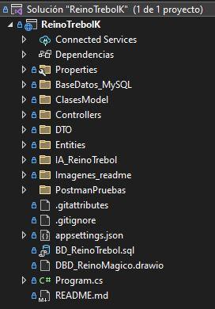
5. Es importante que antes de ejecutar se modifique la configuración de la conexión a la BD de datos, es necesario utilizar los datos que colocaste en la sección de instalación.
6. Ir al archivo **appsettings.json** modificar la linea 10 con la infomacion de conexion de la BD: 
```
"DefaultConnection": "server=127.0.0.1;port=PUERTO;user=ReyMago;password=PASSWORD;database=reinotrebol;"
```
7. Guardar los cambios.
8. Para ejecutarlo es necesario dar clic en el icono de triángulo verde.
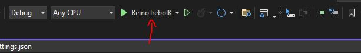
9. Comenzará a cargar, cuando esté listo para enviar peticiones la pantalla se verá así:
    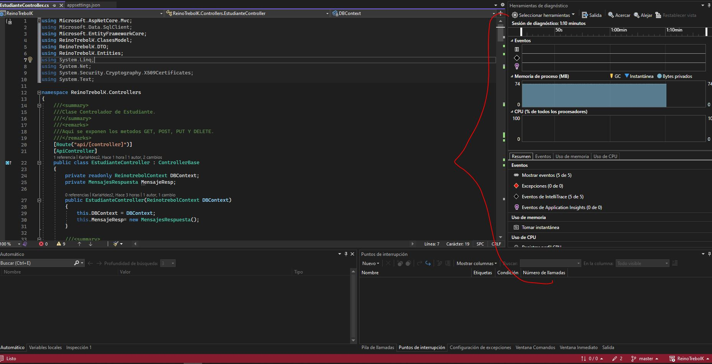
    adicional se abrirá el navegador con la Página de Swagger.
    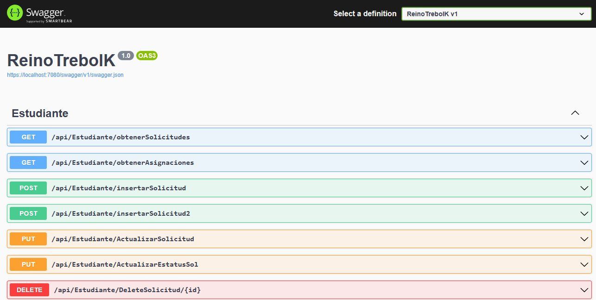
10. Para realizar pruebas con Swagger ir al apartado de este manual Pruebas > Pruebas con Swagger
11. Para realizar pruebas con Postman ir al apartado de este manual Pruebas > Pruebas con Postman

### Consola CMD
Para poder ejecutarlo es necesario tener instalado MySQL, si no lo tienes instalado dirígete a la sección Instalación que se encuentra en este Manual.
1. En la carpeta que lleva por nombre “Ejecución”, esta contiene las dlls, ejecutables y archivos de configuración necesarios para la ejecución del API.
2. Coloca la carpeta en tu ubicación de preferencia.
3. Copia la ruta de dicha ubicación.
4. Abre CMD y dirígete a la ruta copiada, con el siguiente comando:
```
cd “C:\Users\TU\Desktop\PruebaIA\ReinoTrebolK\bin\Release\net6.0”
```
5. Antes de ejecutar es necesario modificar el archivo "appsettings.json", donde se encuentra la configuración de la conexión a la Base de Datos. Se deben de modificar  la linea 10 con la infomacion de conexion de la BD utilizando los datos que colocaste en la sección de instalación:
```
"DefaultConnection": "server=127.0.0.1;port=PUERTO;user=ReyMago;password=PASSWORD;database=reinotrebol;"
```
6. En la ventana de CMD, es necesario ejecutar el siguiente comando:
```
ReinoTrebolK.exe
```
8. Listo, API Rest ya está “arriba” y listo para utilizarse, ir al apartado Ejecución a través de Postman para poder probar.
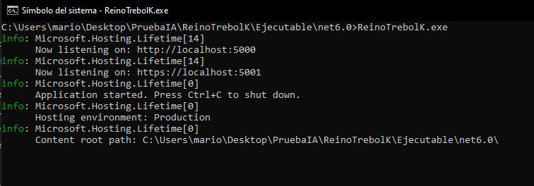


## Pruebas
Para las pruebas se pueden realizar de 2 formas, con las aplicaciones Postman o Swagger.
### Pruebas con Postman
1. Descarga la carpeta que lleva por nombre Pruebas_Postman
2. Abrir Postman
3. Dar clic en el botón Import
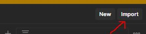
4. Se abrirá una ventana, dar clic en Upload Files.
5. Se abrirá el explorador de archivos.
6. Dirigirse a la carpeta que descargaste “Pruebas_Postman”, dentro de ella se tiene un archivo con el nombre de “ReinoTrebol.json”, seleccionar dicho archivo.
7. En la ventana de Import dar clic en el botón Import.
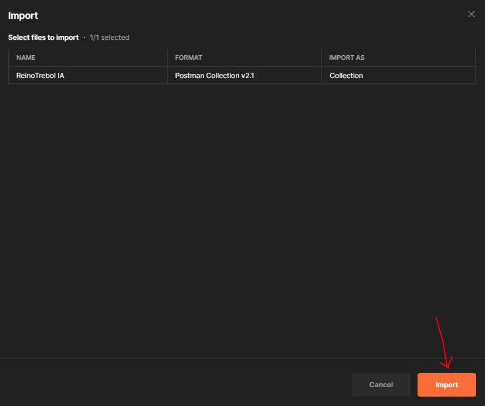
8. Listo se creará la colección que contiene los métodos disponibles.
9. En cada uno al seleccionar ya se tiene precargado un ejemplo del request.
10. Antes de dar clic en Send/Enviar es necesario validar en nuestra consola de CMD o en nuestro Visual Studio en que puerto se está ejecutando la API.
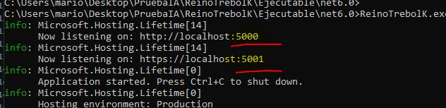
11. Si el puerto es diferente al que se tiene configurado en el Postman solo es necesario cambiarlo en cada uno de los métodos por el 5001.
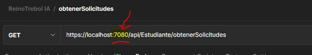
12. Listo, una vez modificado el puerto ya se puede ejecutar el metodo.
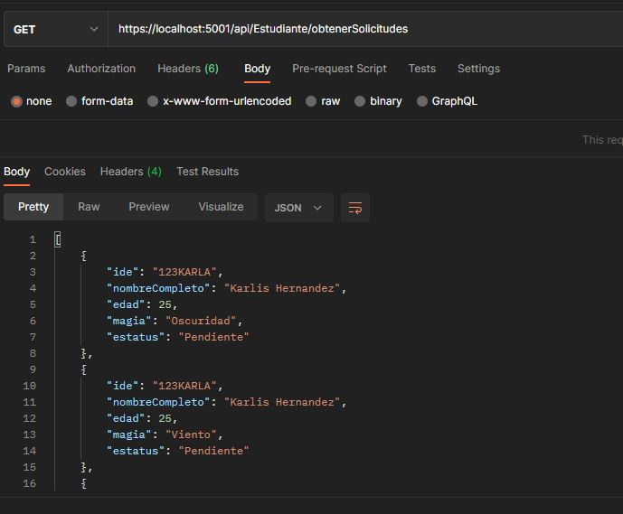

### Pruebas con Swagger
Para las pruebas desde Swagger es necesario ejecutar la API desde Visual Studio 2022.
1. Ir al navegador y abrir la url: https://localhost:7080/swagger/index.html
2. En esta se vera la pantalla de Swagger que funciona similar al Postman.
3. Selecciona el método a utilizar.
4. Dar Clic en el botón ** Try it out **
5. Esto habilitara el apartado de parametros o request para los metodos PUT y POST, adicional se aparecera el botón Execute.
6. Dar clic en Botón Execute y esto enviara la peticion al API.
    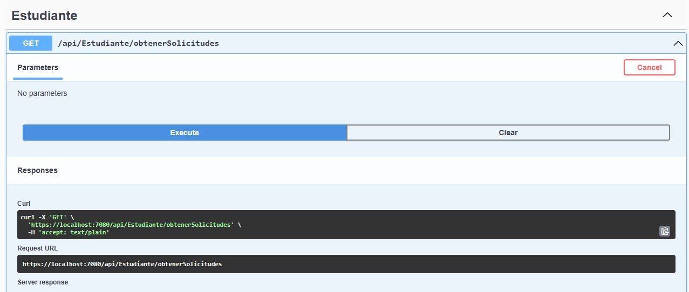
7. Listo, asi es como se puede ejecutar cada uno de los métodos.
